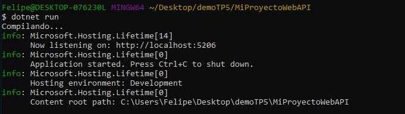
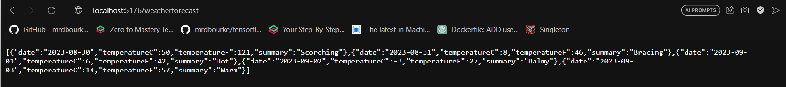
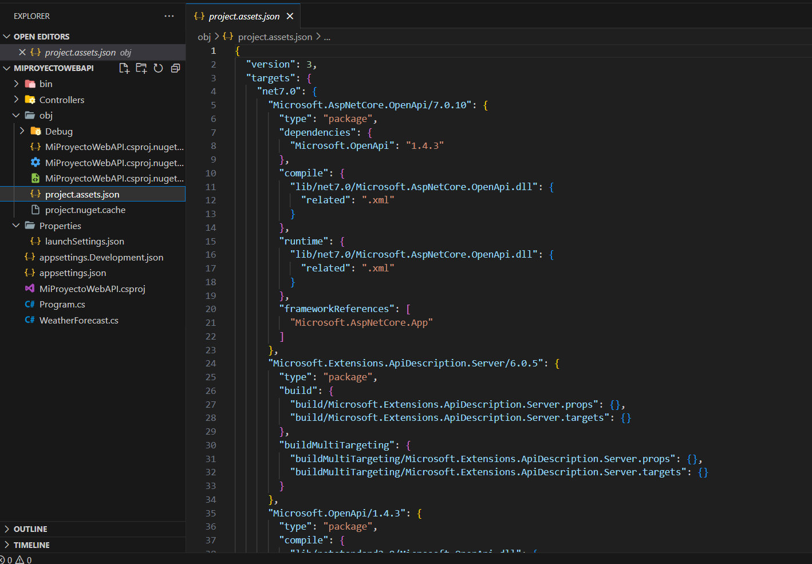
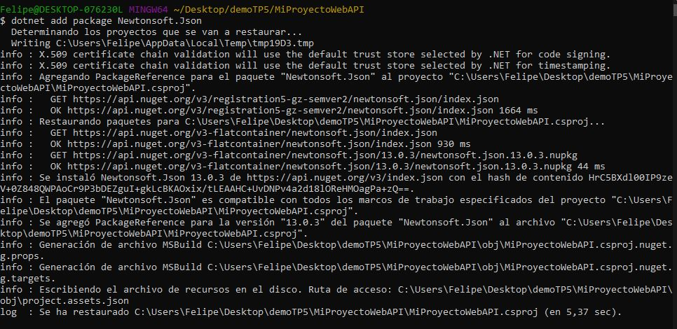
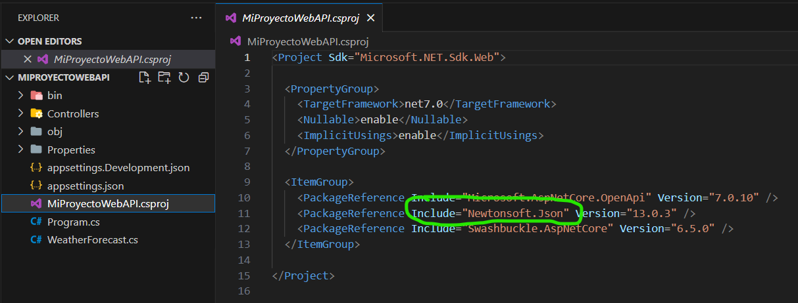
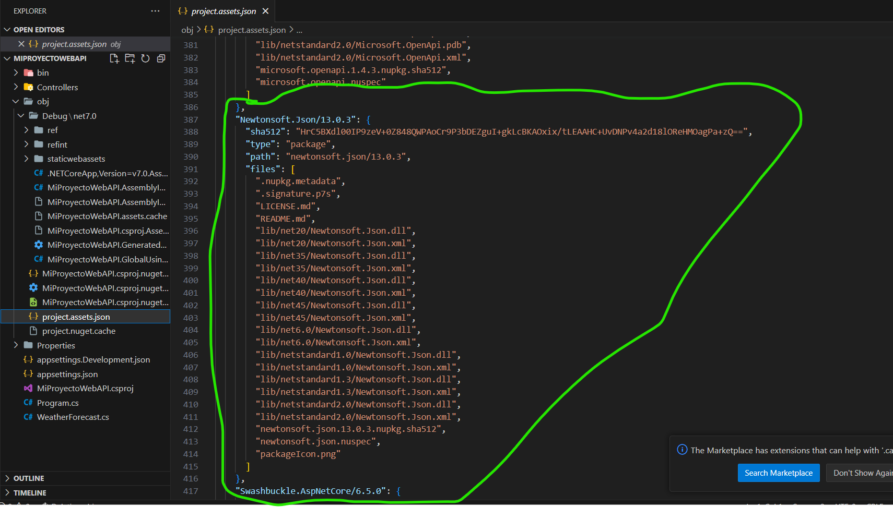
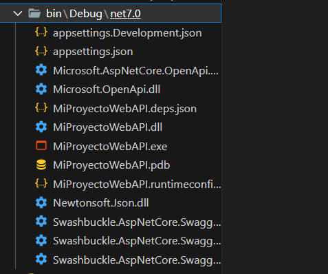
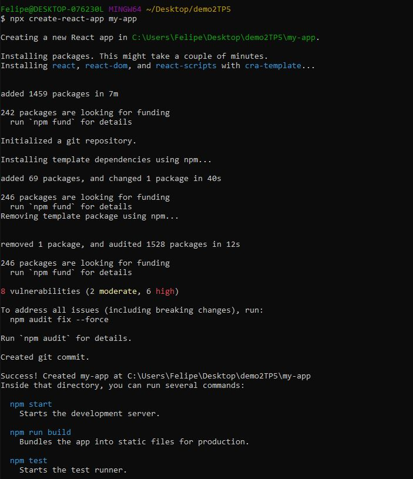
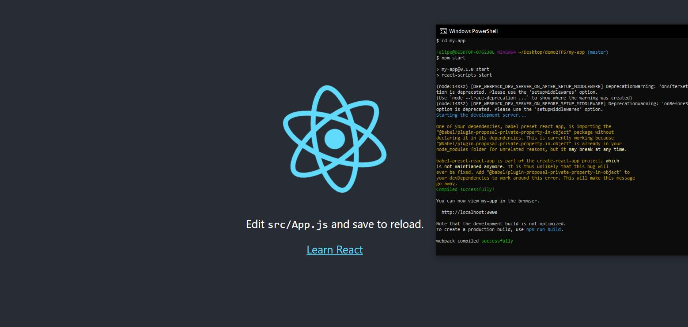
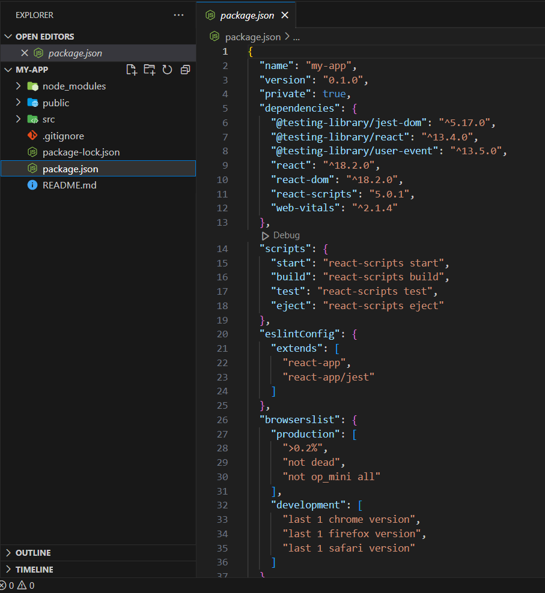

# Trabajo Práctico 5 - Herramientas de construcción de software

## 1. Ejemplo en c# y .NET Core

- Ejecutar la aplicación.

- Entrar a la url con /weatherforecast

- project-assets.json

- Borrar bin y obj

- Agregar newton.json

- MiProyectoWebAPI.csproj

- project-assets.json con newton

- Borrar bin y obj nuevamente

- Contenido de net7.0 luego de ejecutar de nuevo la aplicación

## 2. Ejemplo con node.js

- Crear aplicación react

- npm start

- Manejo de paquetes de node

## 3. Build tools para otros lenguajes

Java: Maven, Gradle
C: Make, CMake
Python: setuptools, pipenv
C++: CMake, Make
C#: MSBuild
Visual Basic: MSBuild
JavaScript: npm, Yarn
PHP: Composer
Objective-C: Xcode Build System
Swift: Swift Package Manager, Xcode Build System