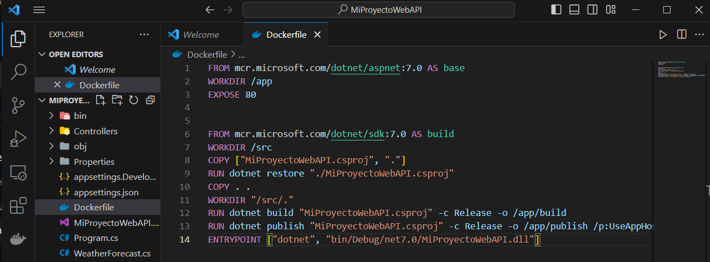
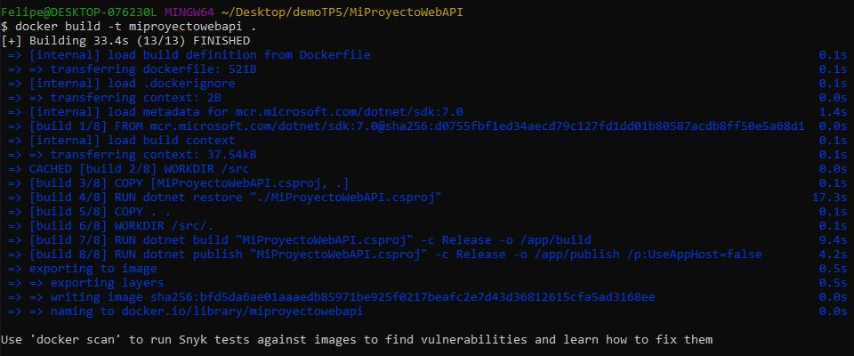
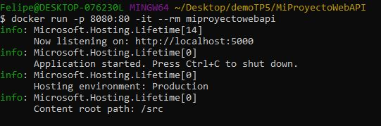
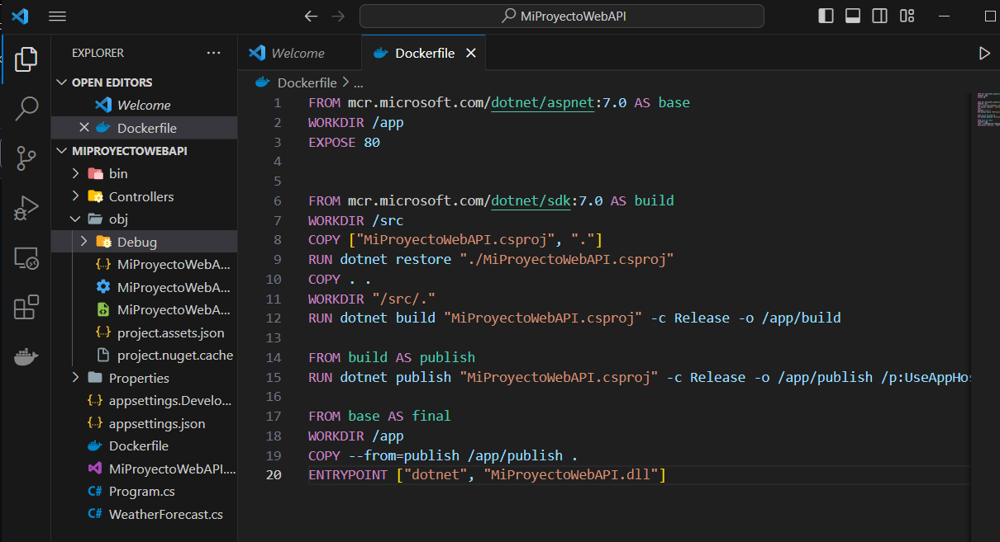
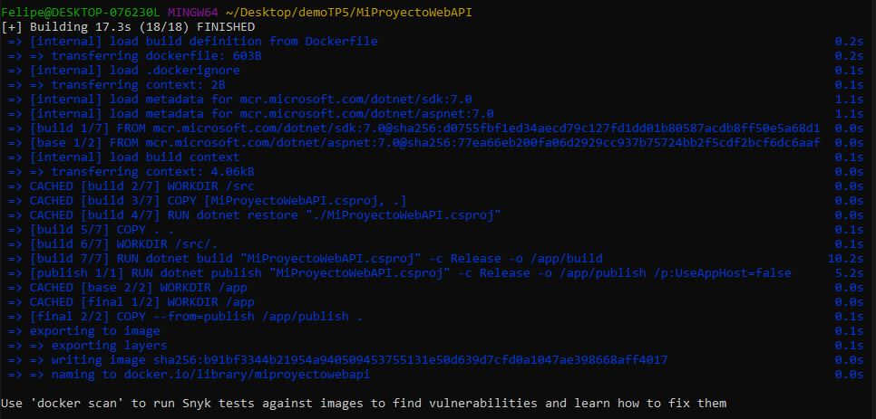

## 1. Describir las instrucciones de un Dockerfile

FROM: Especifica la imagen base que se utilizará para construir la nueva imagen. Es el punto de partida del contenedor.

RUN: Ejecuta comandos en una nueva capa sobre la imagen actual y guarda el resultado. Se utiliza para instalar aplicaciones, paquetes o realizar configuraciones durante la construcción.

ADD: Copia nuevos archivos, directorios o archivos remotos a la imagen. También puede extraer archivos comprimidos automáticamente.

COPY: Similar a ADD, pero se utiliza para copiar archivos y directorios desde la máquina host a la imagen. No tiene la capacidad de extraer archivos comprimidos automáticamente.

EXPOSE: Informa a Docker que el contenedor escuchará en los puertos especificados en tiempo de ejecución. No publica el puerto, pero es útil documentar los puertos que se deben exponer.

CMD: Proporciona valores predeterminados para un contenedor en tiempo de ejecución. Pueden ser reemplazados al ejecutar el contenedor. Especifica el comando y los argumentos por defecto.

ENTRYPOINT: Configura un contenedor para ejecutar un ejecutable específico, y los argumentos que se le pasarán cuando se inicie. Se utiliza para configurar un contenedor como una aplicación ejecutable.

## 2. Generar imagen de Docker

- Dockerfile

- Build

- Run

## 3. Dockerfiles Multi Etapas

- Nuevo Dockerfile

- Build

Se destaca la inclusión de la instrucción FROM build AS publish, que genera una imagen denominada "publish" basada en la previamente creada llamada "build". A continuación, se presenta la instrucción FROM base AS final, que da origen a una imagen novedosa denominada "final", construida a partir de la imagen base. Por último, la línea COPY -- from=publish /app/publish . desplaza el contenido de la carpeta /app/publish de la fase "publish" para integrarlo al directorio de trabajo de la etapa "final".

No están las carpetas app/publish, app/build ni src, ya que fueron creadas en otra imagen que no fue la imagen final, el contenido de app/publish esta copiado en la carpeta app de la imagen final.