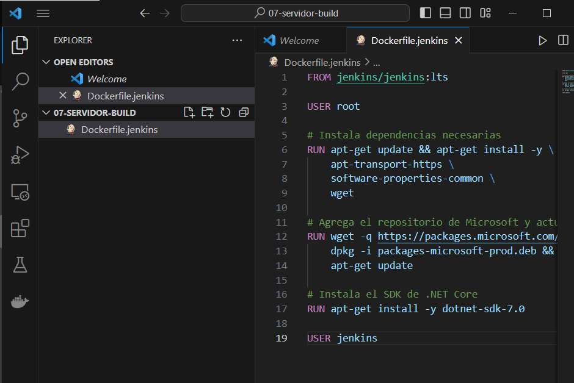
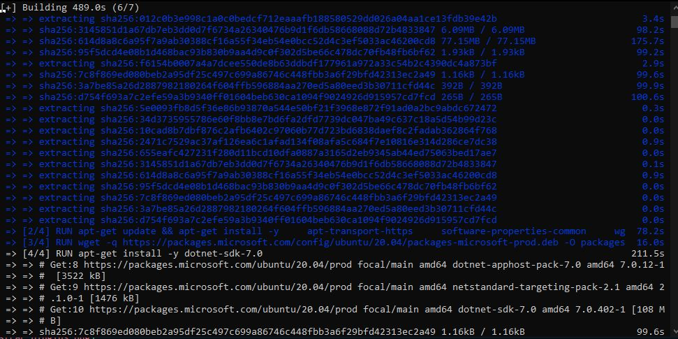
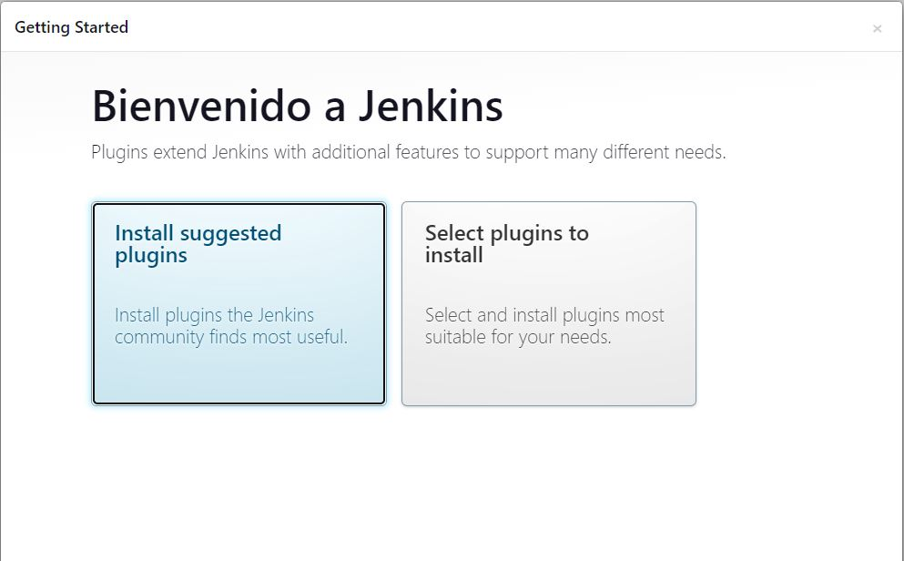
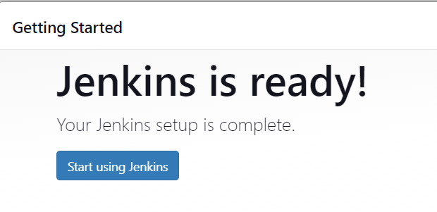
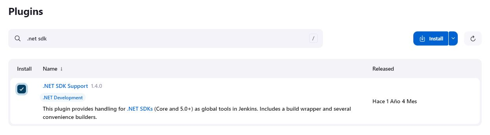
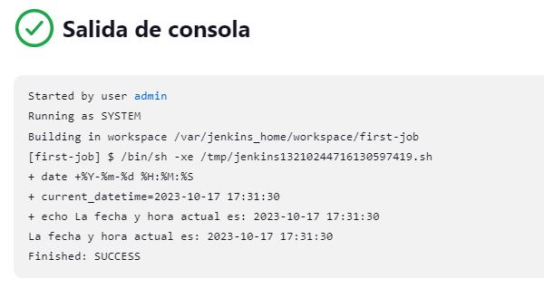
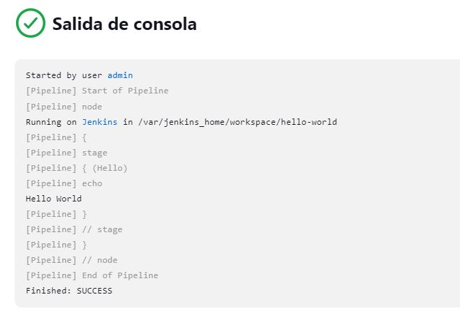
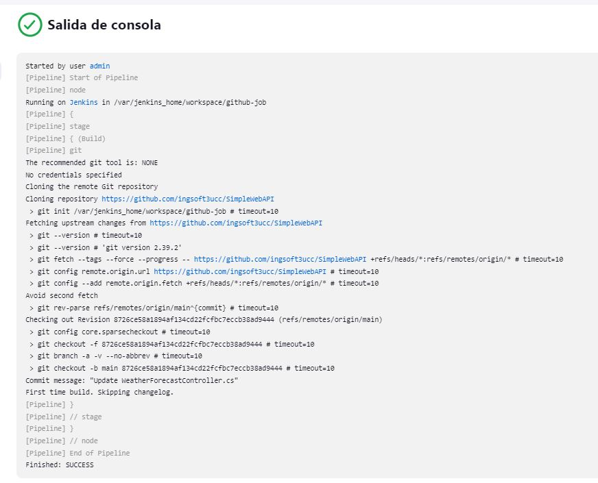

# Trabajo Practico 7 - Servidor de Build (de integracion continua)

# Desarrollo:

## Poniendo en funcionamiento Jenkins

- Imagen de Docker basada en Jenkins

- - Construccion de imagen DOcker 

- Contenedor corriendo

- Entrando al cliente de Jenkins

- Plugins por defecto instalados y usuario creado

- Administrar plugins

## Creacion de Jobs

- Resultado del job de estilo libre

- Hello world

- Resultado del github-job

