# Trabajo Practico 9 - Pruebas Unitarias

- Clonacion de repositorio

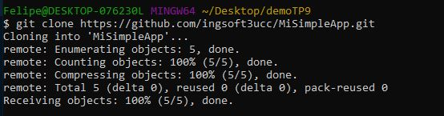

- Revision de codigo

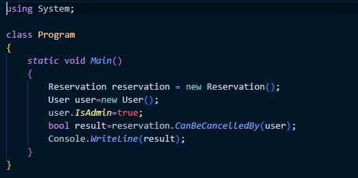

- Creacion de simpleapptests

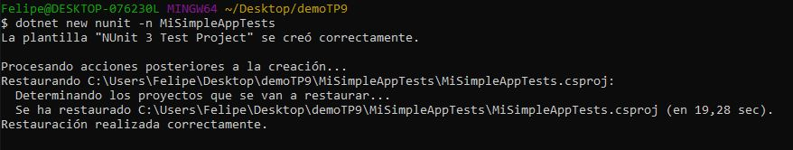

- Agregamos paquetes

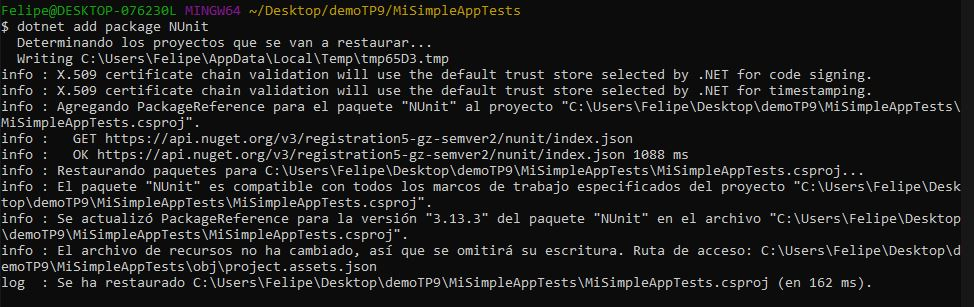

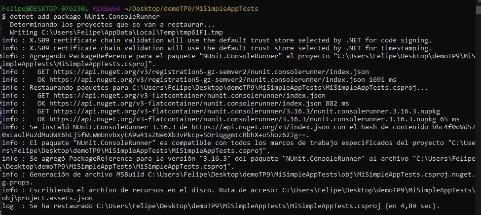

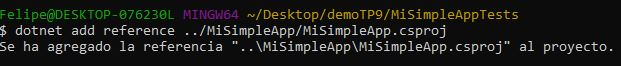

- Instalacion de extension .NET Core Test Explorer

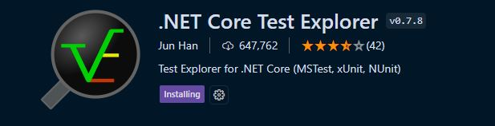

- Edicion de settings.json

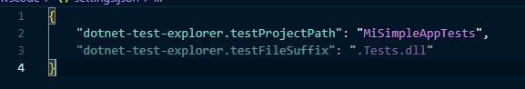

- Run de tests

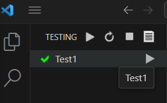

## Creacion de nuestros tests

- Edicion de UnitTest1.cs

- Run de los nuevos tests

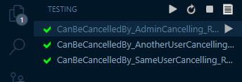

- Edicion del codigo bajo prueba para que falle

- Comprobacion de la falla

- Refactorizacion del codigo

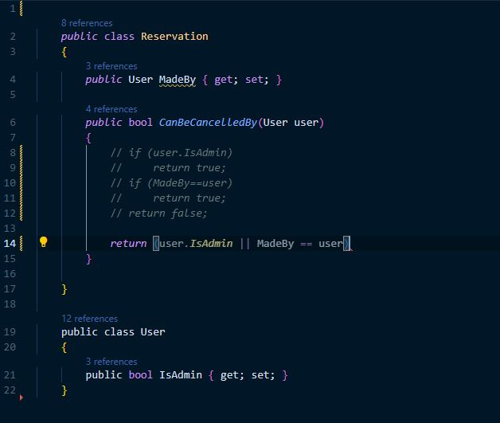

- Dotnet test

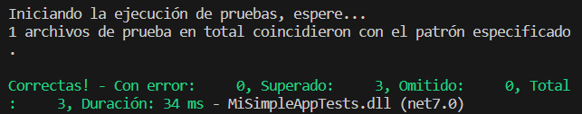

## Desarrollo de pruebas unitarias sobre una WebAPI

- Creacion de proyecto de pruebas

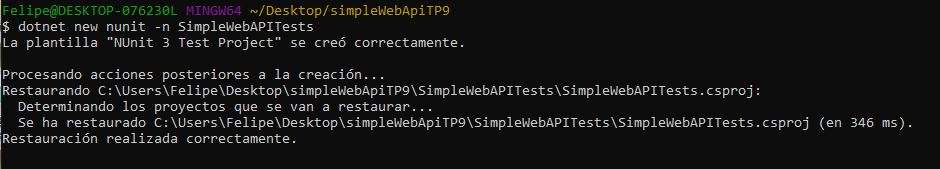

- Add Reference

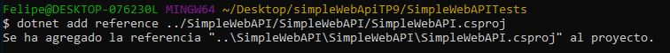

- Edicion de settings.json

- Reemplazo de UnitTest1.cs

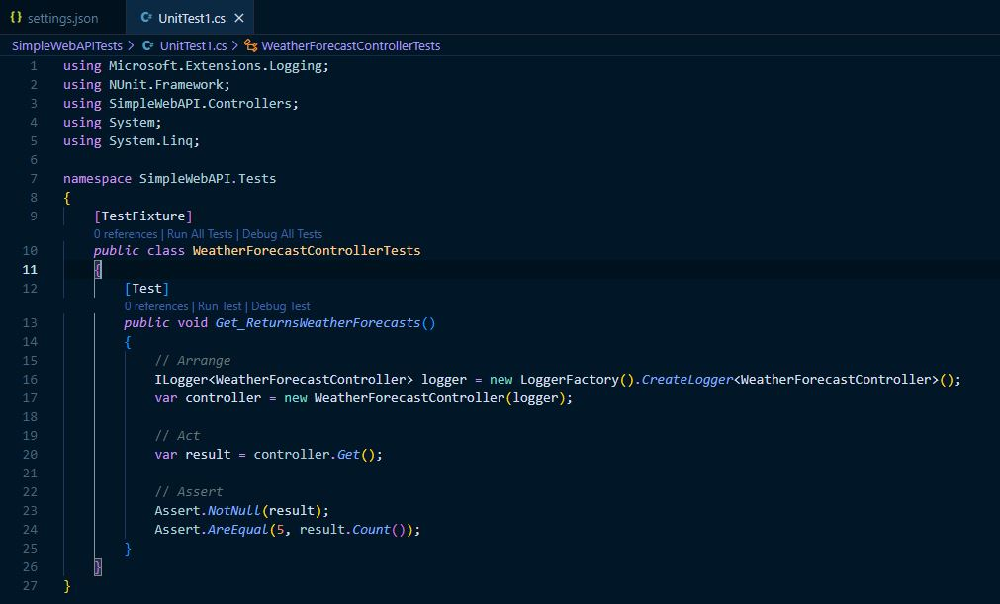

- Resultados de los tests

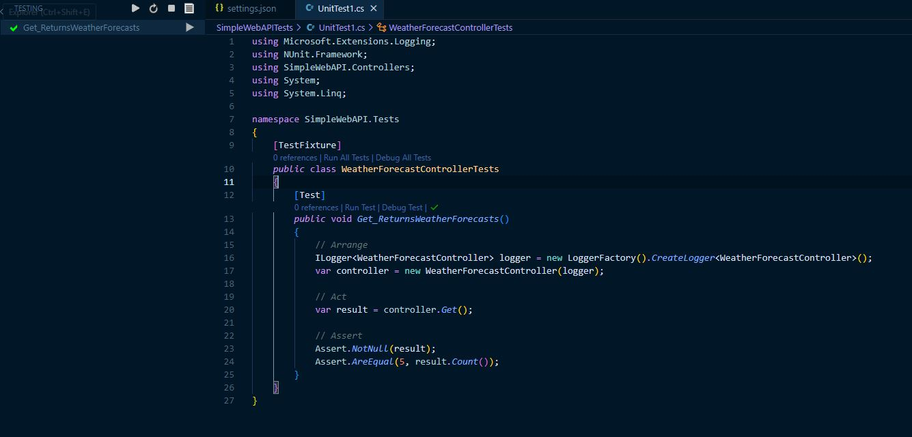

## Tests con mocks

- Resultados de los tests con mock

Primero, en la sección Arrange, se configura el entorno de la prueba. Se crea un contenedor de servicios (ServiceCollection) y se configura un objeto HttpResponseMessage simulando una respuesta exitosa del servidor HTTP con un JSON de modelo de datos ficticio.

Luego, se utiliza Moq para crear un manejador de mensajes HTTP simulado (mockHttpMessageHandler). Se configura para que, cuando se llame al método SendAsync con cualquier HttpRequestMessage y CancellationToken, devuelva la respuesta simulada.

Después, se registra una implementación de la interfaz IApiService en el contenedor de servicios. La implementación concreta de IApiService es ApiService, que se instancia con un objeto HttpClient que utiliza el mockHttpMessageHandler creado anteriormente.

En la sección Act, se resuelve la implementación de IApiService del contenedor de servicios y se llama al método GetMyModelsAsync. Esto activa el código de ApiService que utiliza el HttpClient mockeado.

Finalmente, en la sección Assert, se verifican los resultados de la llamada al método. Se comprueba que el resultado no sea nulo, que haya un solo elemento en la colección resultante y que el título del primer elemento coincida con el esperado.

- test ejecutado

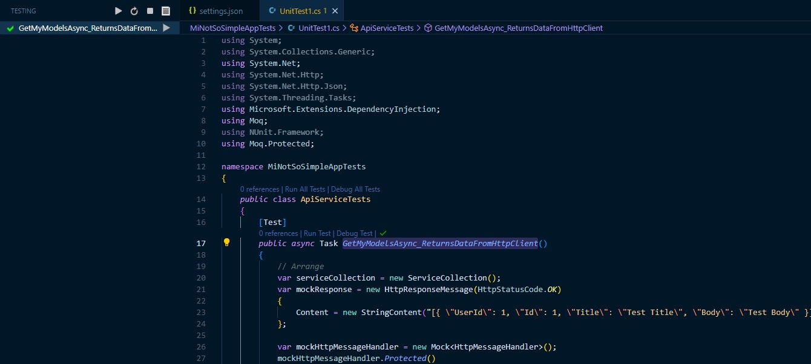